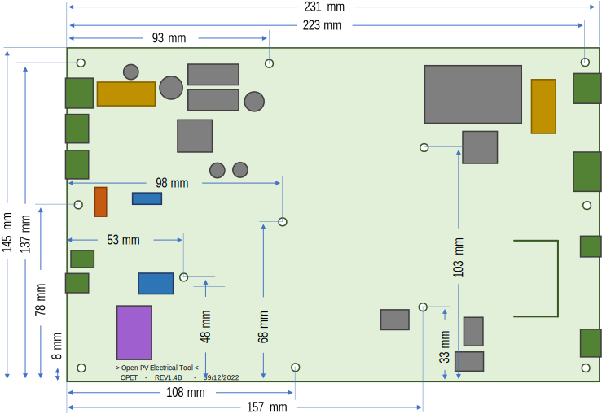
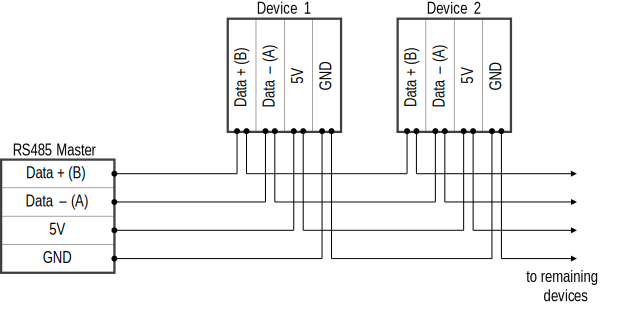
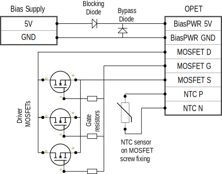
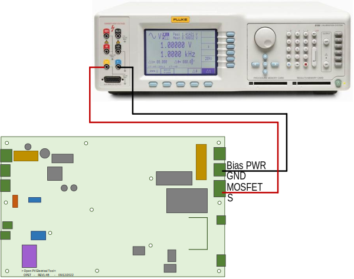

# OPET hardware introduction
This repository contains everything relating to the hardware of the OPET device.  If you are looking for the firmware or software repositories, links are below:

[OPET Firmware](https://github.com/NREL/opet-firmware)

[OPET Control Software](https://github.com/NREL/opet-control)

## Feature summary
- OPET (Open-source Photovoltaic Electrical Tool) is used for performance measurements of solar photovoltaic (PV) devices in the field under natural sunlight or in the lab under artificial light
- Its primary use is in research and development of solar cells and modules, specifically in reliability and durability research of PV devices
- Some features and functions include:
    - IV curve measurements with linear or cosine distributed measurement points
    - PV device active loading at open circuit voltage (Voc), short circuit current (Isc) and maximum power point (Pmp)
    - Bias power supply to overcome series resistance in contact wires for Isc measurements and loading
    - PV voltage input in five ranges from 1V to 100V
    - PV current input ranges
        - Low current version, six current ranges from 1.1mA to 340mA
        - High current version, six current ranges from 50mA to 15A
    - IO ports for I2C and SPI temperature sensor Arduino extension boards
    - Integrated fan control

## Safety note

## General Specifications
- Input Power
    - Amplifier supply: 24 Vdc nominal (19 Vdc -- 29 Vdc)
        - Low Current Version 250mA maximum
        - High Current Version 150mA maximum
    - RS485 supply: 5 Vdc nominal (4.75 Vdc -- 5.25 Vdc), 200mA maximum for entire bus
    - High current OPET PV bias supply: 2.0 Vdc to 5.5 Vdc, 15A maximum
    - Fan relay power feedthrough: 24 Vdc recommended (\<150 Vdc, \<100 Vac), 2A maximum
- Electrical Protection
    - Amplifier supply: 30 Vdc, fused with 500 mA ceramic fast blow 20 mm x 5 mm fuse
    - RS485 supply: 5.6 Vdc, requires external 250 mA inline fuse for RS485 bus
    - PV voltage: 100 V on all ranges
    - PV current, High current OPET PV bias supply: 100 V on all ranges
    - High current OPET PV bias supply and PV current:
        - 15 A on all ranges, fused with 16 A \>100 Vdc rated 32 mm x 6.3 mm ceramic fuse
    - Low current OPET PV current:
        - 340 mA on all ranges, fused with 500 mA \>100 Vdc rated 20 mm x 5 mm ceramic fast blow fuse
        - It should survive at 15A current spike with the correct fuse installed in case a full-sized module is connected to a low current OPET by accident, but not tested yet
- Environment
    - Temperature
        - Operation 0 °C to 40 °C
        - Storage -30 °C to 60 °C
    - Relative humidity (non-condensing)
        - Operating 0 °C to 28 °C \<90 %
        - Operating 28 °C to 40 °C \<80 %
        - Storage -30 °C to 60 °C \<95%
    - Altitude
        - Operating up to 3,000 Meters (limited by PCB track spacing according to ICP 2221)
        - Storage up to 12,000 Meters
- Remote interface
    - RS485 half-duplex, 200k baud, up to 32 devices per bus

## Electrical Specifications

### PV Voltage Specifications
- Maximum input: 100V on any range
- Measurement method: 16bit SAR ADC
- Input characteristics:
    - Range defines the nominal range value; system is designed with a \>3% overrange margin
    - Eff. ADC resolution describes the ADCs effective performance, \~15bit
        - The 1V range is effectively a part of the 4.2V range
    - Accuracy is given as ± (% of measurement + % of range), detailing scale and offset uncertainty respectively
        - The total uncertainty of a measurement is defined as $U = \ \sqrt{{U_{Scale}}^{2} + {U_{Offset}}^{2}}$
        - Uncertainty is reported with a 95% confidence (k=2)
        - Uncertainty is largely based on theoretical calculations, albeit care has been taken to include every conceivable source, these may not be fully representative, design requirement was a total uncertainty of less than 0.1%
        - Uncertainty given excludes external calibration uncertainty, calibration should be caried out using suitable equipment that does not add a significant contribution
    - Input impedance describes the total voltage terminal resistance path when voltage is within selected measurement range, the resulting current leakage is corrected on current measurements taken
    
| Range | Eff. ADC resolution |    Accuracy     | Input Impedance |
|:-----:|:-------------------:|:---------------:|:---------------:|
| 1.0 V |       0.14 mV       | 0.011% + 0.031% |    1.100 MΩ     |
| 4.2 V |       0.14 mV       | 0.011% + 0.007% |    1.100 MΩ     |
| 10 V  |       0.32 mV       | 0.019% + 0.007% |    0.163 MΩ     |
| 30 V  |       0.97 mV       | 0.025% + 0.007% |    0.115 MΩ     |
| 100 V |       3.23 mV       | 0.038% + 0.007% |    0.104 MΩ     |

### PV Current Specifications
- Maximum input:
    - High Current OPET: 15A on any range
    - Low current OPET: 340mA on any range
- Measurement method: 16bit SAR ADC
- Input characteristics:
    - Range defines the nominal range value; system is designed with a \>3% overrange margin
    - Eff. ADC resolution describes the ADCs effective performance, \~15bit
    - Accuracy is given as ± (% of measurement + % of range), detailing scale and offset uncertainty respectively
        - The total uncertainty of a measurement is defined as $U = \ \sqrt{{U_{Scale}}^{2} + {U_{Offset}}^{2}}$
        - Uncertainty is reported with a 95% confidence (k=2)
        - Uncertainty is largely based on theoretical calculations, albeit care has been taken to include every conceivable source, these may not be fully representative, design requirement was a total uncertainty of less than 0.1%
        - Uncertainty given excludes external calibration uncertainty, calibration should be caried out using suitable equipment that does not add a significant contribution
- Current measurements are corrected for leakage through the PV voltage channel impedance

#### Low current OPET
|  Range  | Eff. ADC resolution |    Accuracy     | Shunt Resistance |
|:-------:|:-------------------:|:---------------:|:----------------:|
| 1.1 mA  |       35.1 nA       | 0.050% + 0.017% |     23.20 Ω      |
| 3.2 mA  |      104.4 nA       | 0.049% + 0.008% |     23.20 Ω      |
| 11.0 mA |       360 nA        | 0.056% + 0.017% |      2.26 Ω      |
|  33 mA  |       1072 nA       | 0.055% + 0.008% |      2.26 Ω      |
| 110 mA  |       3.70 µA       | 0.053% + 0.018% |      0.22 Ω      |
| 340 mA  |      11.01 µA       | 0.052% + 0.008% |      0.22 Ω      |

#### High current OPET
|  Range   | Eff. ADC resolution |    Accuracy     | Shunt Resistance |
|:--------:|:-------------------:|:---------------:|:----------------:|
| 50.0 mA  |      1629.0 nA      | 0.059% + 0.017% |      0.50 Ω      |
| 150.0 mA |      4843.6 nA      | 0.054% + 0.008% |      0.50 Ω      |
| 500.0 mA |      16290 nA       | 0.055% + 0.017% |      0.05 Ω      |
| 1500 mA  |      48436 nA       | 0.058% + 0.008% |      0.05 Ω      |
| 5000 mA  |      162.90 µA      | 0.057% + 0.017% |      0.01 Ω      |
| 15000 mA |      484.36 µA      | 0.058% + 0.008% |      0.01 Ω      |

# Preparing for Operation
- The OPET circuit board needs to be prepared and set-up for operation
- First an overview of the OPET printed circuit board (PCB) is given
- it is detailed how to wire up and power the system
- enclosure with air-cooling requirements and recommendations are also given

## Circuit Board overview and outline

### Low current OPET PCB overview

### High current OPET PCB overview

### Dimensions
- Both, low and high current OPET boards have the exact same PCB with a different set of components
- hence, board dimensions and the positions of the mounting holes are the same

### Connectors
- All of the side connectors on the OPET are pluggable screw or clamp terminals
    - This is to reduce the strain on the PCB when connecting a cable
- CAUTION:
    - Always disconnect the pluggable connector before connecting/removing wires from the plug
    - Not removing the plug puts pressure onto the board from the top when tightening or loosening the screw that bends the PCB and can cause micro-cracking in components
    - Early failure especially in capacitors and changes in performance with calibration drift may be result
- The labelling of connectors is done on the front and the backside of the PCB, so that it is easily readable in different mounting positions
- Labelling is as following, see section in 2.2 for further details:
    - Amp PWR: 24V & GND amplifier power supply input
    - RS485: two RS485 communication ports with A & B data lines and 5V & GND supply input
        - One for input and one for feedthrough to the next unit
    - Fan: standard molex fan connector powered from the 24V Amp PWR input
    - FT: fan power feedthrough relay connection to be used with an externally powered fan
    - SPI & I2C ports: these are expansion sockets to connect a breakout module with RTD or thermocouple sensor
    - PV Curr: for the current carrying pair of the 4-wire contacts to the PV device
    - PV Volt: for the voltage sensing pair of the 4-wire contacts to the PV device
    - Bias PWR: for the bias power supply input on the high current OPET version
    - MOSFET: for the external driver MOSFET if not onboard
    - NTC2: for the external driver MOSFET temperature sensor

### Headers, Jumpers and Fuses
- Two headers are positioned in the left area of the PCB with following function:
    - ISP: is the 6-pin In-System Programmer port used to program the microcontroller on the board
    - JTAG: the Joint Test Action Group port is used for debugging and programming of the onboard microcontroller
        - This port is normally disabled to make room for the RS485 address selection
        - Is very useful for updating and finetuning the controller code
        - Make sure ADR jumpers are removed before using this port
    - Both ports follow the standard AVR pin-out and can be connected directly to a programmer
        - an Atmel-ICE programmer has been used during the design of OPET

- The ADR jumper row is used to set the RS485 address of the OPET device

### Fuses
- WARNING:
    - Always replace fuses on the OPET with the correct type and specifications
    - Using the wrong fuse may cause no-functioning protection in case of a fault, which can lead damaged equipment and/or personal injury
- OPET has 2 fuses onboard
    - All Are ceramic fuses, they are used for an improved DC and current braking capability rating
- FS1: amplifier power input fuse
    - 20x5 mm ceramic fuse, 500 mA ≥50 Vdc rated, fast action
    - ideally use "Littelfuse 0216.500MXP"
    - this fuse can blow if the amplifier input voltage is too high and the 30 V Zehner diode protects the input to the DC/DC converters
- FS4: PV device current protection fuse
    - Low current OPET: 20x5 mm ceramic fuse, 250 mA ≥100 Vdc rated, fast action
        - Important to use "Littelfuse 0216.250MXP"
    - High current OPET: 6.3x32 mm ceramic fuse, 15-20 A ≥100 Vdc rated
        - use "Littelfuse 0314015.MXP" 15A fuse or Littelfuse 0314020.MXP" 20A fuse, or "Schurter 8020.5023" 16A fuse
        - IMPORTANT:
            - this fuse is likely to get very hot (\>80°C) when operating at or near maximum specified currents (15 A)
            - hence its recommended to use a 20 A fuse when the PV load is likely to reach near to 15 A current flow, this reduces heat on the OPET board and degradation of the fuse over time (early fuse failure)

### Indicators
- OPET board has 3 indicator LEDs in the left side:
    - Green: Power indicator
        - Indicates if the Microcontroller is receiving 5V input voltage
    - Orange: Output enabled indicator
        - In principle this LED indicates if the output of the OPET is
            - Enabled, driver controller in active voltage regulation
            - Disabled, driver controller inactive with high impedance input (Voc) at PV current input
        - Indicator shows enabled if the power output is requested to be enabled
        - In case of an error (see below error indicator details), the actual output can be high impedance inactive, while the output indicator is still active
            - this is to indicate that as soon as the error clears the output will become active automatically
        - in Voc load mode, the output is also inactive high impedance, while the OPET shows an output active indicator
            - this is to show that the output is requested to be active and ready to measure IV curves in between Voc loading at high impedance
    - Red: Error active indicator
        - This LED will become active when the OPET has detected an error during operation
        - Some errors will lead to a temporal disabling of the output if the output was requested to be on to start with, others are indicative only
        - The type of error that is active can be queried when requesting load measurement data or reading the status byte (see 4.3.1.1 for more details)
        - In case of voltage or current ADC measurement errors the error LED is likely to flash constantly or briefly, if observing this:
            - Check measurement ranges
            - Check stability of PI controller
            - Check noise level on the current and voltage signals
            - Check PV device connection polarity

## Electrical connections and set-up

### Amplifier Supply
- The AMP supply input of the OPET is used to power the electronics on the PCB
    - On the Low current OPET version it also sources the Bias voltage through a DC/DC converter connected to the AMP supply input
- The nominal voltage of the input is 24V, with an input range of 19-29 V
    - Can be powered with a 24V battery system, however it needs additional battery management and protection as OPET will not automatically switch off when it reaches under-or over-voltage conditions
- Normal current draw is \~60-75 mA if the output is off
    - Low current OPET versions can have up to \~150 mA current draw at maximum current PV load
- The AMP input has following protections:
    - reverse polarity protection
    - over-voltage protection with a 30V Zehner diode
    - and fused with a 500 mA 20x5 mm ceramic fuse,
        - Ceramic fuse is used to reach an improved DC and current braking capability rating
- The AMP input is also Isolated, to the rest of the electronics excluding the fan using isolated DC/DC controllers
    - This reduces problems occurring due to ground shifting when connecting multiple OPET boards on to one supply
- OPETs have an AMP input filter and DC/DC output filter to reduce noise impact, it is however still recommended to use a high-quality supply with low output ripple noise
- When selecting a power supply, it is also important to make sure its maximum capacitive load requirement is above the input capacitance of the OPET PCBs (\~25µF) multiplied by the number of boards connected

### RS485 Bus Communication
- OPET incorporates an isolated half-duplex RS485 port for communication
- Up to 32 devices can be connected to a single RS485 bus
    - OPET is designed for 32 devices on one bus, this has not been fully tested
- OPET has two connectors for RS485 onboard
    - one for the RS485 input and one to feedthrough to the next device on the bus
    - both can be used for either function
- To connect OPET devices to a computer it is recommended to use a USB to RS485 converter, devices have been tested with the FTDI USB-RS485-WE-1800-BT USB to RS485 converter
- Following connection schematic is used to connect the OPET systems to a RS485 bus

#### Bus Power Supply
- Since an isolated RS485 system is used to electrically separate multiple devices from each other and to reduce interference the RS485 must be powered with an external 5V supply with a minimum current output of 250mA
- This is in many cases is already incorporated into the USB-RS485 converter, such as with the recommended converter given in the section above, if not, the RS485 bus can be powered with an external supply
- power is feed through from device to device in the same way as the data lines
- The input voltage must be within the range of 4.75 V and 5.25 V for the RS485 transceiver on the OPET to work correctly
- The input is reverse polarity protected and has a 5.6V Zehner clamping diode to protect against short time overvoltage spikes at the input to the transceiver.
    - Short time: maximum a few seconds dependent on the input voltage, fault current and heat on the Zehner diode
    - A 250 mA fuse in line with the RS485 bus power is recommended to enhance protection
    - Current may be electronically limited when using a USB to RS485 converter with 5V output powered via USB, a fuse is in this case not needed
    - If an external dedicated power supply is used to power the RS485 bus is advised to use a 250 mA series fuse in the 5V line to the first OPET device.
- Since up to 32 OPET devices are connected in series via the feedthrough connections and hence the total length of the bus cable can be long, it is advised to use as large wire gauge as possible to reduce the voltage losses within the bus to less than 0.15 V on a 5 V bus input to stay within the transceiver operating voltage range from the first to the last device on the bus while still allowing for input voltage tolerances
    - Total length: keep as short as possible to reduce losses
    - Wire gauge: OPET connectors accept 20 to 26 AWG, the thicker the conductor the lower the losses

#### RS485 bus termination and biasing
- To improve communication reliability and quality the RS485 bus uses termination and biasing techniques
- RS485 bus termination is used to reduce/eliminated signal reflection at the end and start points of the bus
    - Done by connecting a 120 Ω resistor at each end of the bus in series from data A to data B
    - The recommended FTDI USB to RS485 converter has this incorporated and just needs shorting of the dedicated wires to enable 120 Ω termination at the bus start point
    - The OPET device does not have a termination onboard and a external 120 Ω resistor should be connected to the feedthrough terminal (whichever connector is not used yet) of the last device in line from contact A to B
    - a termination is typically not needed on very short bus line (\<2m) with only a few devices connected
- RS485 bus biasing is used to keep the voltage potential of the data lines A & B apart from each other when the bus is inactive and none of the devices on the bus are transmitting
    - Too little biasing can cause accidental start pulses on the bus and interrupt communication
    - OPET has biasing resistors included that allow for optimal biasing at 32 devices on the bus (68 kΩ per device, \~2.1 kΩ in total with 32 devices on the bus)
    - External biasing when not using 32 devices is usually not needed, however if using an old RS485 transceiver (USB to RS485 converter or similar) this may be need when communicating to only a few devices
    - If communication is in the above case unreliable / not working at all do following:
        - At the start of the RS485 bus before the first device connect
            - a 10 kΩ resistor from Data A to 5V
            - and a 10 kΩ resistor from Data B to GND

#### How to set the hardware bus address 
- The bus address of each OPET device is determined by hardware addressing on the PCB, which is the jumper header next to the RS485 connectors
- Any device can have any bus address independent of its position on the actual RS485 bus as long as the address is not used twice
    - In case of using a bus address twice, communication to this address will fail as two devices will start using the bus at the same time
    - OPET does not recognise bus communication collisions when multiple devices communicate at the same time, nor does OPET have an auto-addressing function
- To set the address of a OPET do the following:
    - Insert a jumper into the positions required that make up the desired address number in binary code
    - Address = 1\*x + 2\*x + 4\*x + 16\*x, while x represents a 1 if jumper is inserted and 0 if not
    - Addressing starts at 0 and ends at 31, for a maximum of 32 devices
- IMPORTANT:
    - Remove the Address jumpers when using the OPET in debug mode with a JTAG
    - The default address when debugging is "1" `A:...`
    - See the software programming notes for more details

### FAN and FT connectors
- The FAN connection uses a standard molex connector for computer fans
    - It is powered by the AmpPWR supply; hence it is recommended to use a 24V fan
    - Fan power is not in-line with the amp power fuse
    - up to 2A current rating limited by the control relay
- The FT connector is a relayed power feedthrough that closes when the fan is controlled on
    - This can be used to power fans from an additional power supply
    - Voltage rating is \<150 Vdc, \<100 Vac, 2A current rating
- The fan control is a simple on/off control
    - controlled either manually or automatically (by default) by temperature and load power hysteresis that can be configured in the EEPROM (see section 5.3.19)

### SPI and I2C ports
- The SPI and I2C ports can be used to connect breakout board to the OPET
- Main use is to connect temperature sensor breakout boards
- OPET currently supports following boards:
    - Adafruit MCP9600 I2C Thermocouple Amplifier
        - Connected directly to J8
    - Adafruit MAX31865 RTD PT100 or PT1000 Amplifier
        - Connected directly to J18
    - See section [XXX]{.mark} for details on how to configure a temperature sensor breakout board
- IMPORTANT:
    - Switch off the OPET before disconnecting or connecting a breakout board
- The pinout description is given on the OPET PCB and below

### High Current OPET Driver Stage and Voltage Bias Supply
- WARNING:
    - Do not connect/ disconnect test leads from the bias voltage supply to the OPET when it is under load or when the PV device is placed under light and supplying electricity
    - Do not connect/ disconnect test leads from the driver MOSFET to the OPET when it is under load or when PV device is placed under light and supplying electricity
    - Cover the module with cardboard or similar to remove light input and power off OPET when connecting / disconnecting test leads
- The driver MOSFET and bias voltage protection diodes are mounted externally on a heatsink due to the additional heat produced from the larger load and current flow
- The bias voltage supply is also external, as it needs to supply the same current as the PV device
- Due to the low load current and total heat dissipation, those components are internal on the low current OPET versions
- The bias voltage supply is connected with two protective diodes:
    - One diode in series for reverse polarity protection
    - And one diode in parallel to bypass the voltage supply in case it is switched off or cannot keep up with the PV device load current
    - The "onsemi FFPF30UP20STU" diode is recommended
        - due to its low forward voltage even at high currents (typically 0.9 V at 15 A)
        - due to its isolated case, meaning no thermal pads are needed, only thermal paste, which improves thermal conductivity significantly
- the requirements of the bias voltage power supply are as follows:
    - output voltage minimum 0 V (just shorted) to maximum 6 V
        - dependent on the length of the cable to the PV device and the maximum current flowing
        - the losses on the cables, protection diode and within the OPET board must be lower than the voltage bias supply to be able to measure directly at I­sc load
        - if the bias voltage is too low, the OPET system will not be able to get to Isc loading at the PV device, which may be less of a problem with high voltage PV modules, but will cause problems when measuring wafer sized solar cells
    - output current of at least the expected maximum current of the PV device
        - a reserve headroom of \~30% is recommended
        - if the PV load current exceeds the bias voltage supply current, the current is bypassed through the protective diodes, meaning the OPET will not be able to reach Isc load
    - use a power supply with the lowest noise possible, as this will improve measurement quality and stability
        - unlike the low-current OPET version with bias supply on-board, the high current version has no bias voltage supply filter
        - a noisy voltage supply will cause noisier PV load measurements
    - when using a single bias voltage supply for multiple high current OPETs:
        - connect them using a star connection directly to the power supply terminals, as this will reduce voltage loss and reduce board to board noise coupling
        - use protective diodes for each board separately, to prevent PV load power flow from one board to another
- The driver MOSFET is connected to the MOSFET input of the OPET
    - The "IXYS IXFN132N50P3" MOSFET is recommended
        - Due to its high current and voltage load capability
        - Due to its large metal base footprint and ability to sink up to 1.5kW of power
        - Due to its isolated base, meaning no thermal pad is needed, only thermal paste, which improves thermal conductivity significantly
    - Is its recommended to use one driver MOSFET only, but multiple can theoretically be used
        - This can increase the practical maximum load
        - however, comes with additional difficulties, see end of this section for recommendations
- A NTC thermal sensor is additionally mounted onto the MOSFET and connected to the OPET, to make sure the system does not overheat
    - Recommended NTC is the "EPCOS B57703M0103A018"
        - Has through hole mounting and comes wire leaded
- Refer to section 2.3.3 for details and requirements to mount the MOSFET and diodes on a heatsink
- Wire requirements are as follows:
    - MOSFET and Bias voltage connectors accept 12 to 24 AWG
    - The thicker the conductor the lower the losses induced by wire resistance and current flow
    - The MOSFET should be connected using the shortest wiring possible, as long cables may introduce high stray capacitance and inductance on the MOSFET gate that reduce driver stability
    - The Bias Voltage protection diodes should also be as near as possible to the OPET, but this requirement is less important
- Following connections need to be made to connect the driver MOSFET and bias voltage with protection diodes:

- Using multiple driver MOSFETs (untested):
    - Use the same type of MOSFET for all
        - Need to be able to sink the current and voltage each, as per datasheet
    - Need to be mounted onto the same heatsink with as good as possible thermal coupling
        - Temperature differences can cause a thermal runaway that cause the hottest MOSFET to carry even more load, heating it further, possibly leading to failure
        - If one MOSFET overheats and fails, all are likely to fail in a cascading failure
        - Thermal coupling can reduce the imbalance between MOSFETs significantly
    - MOSFETs need to have each a separate gate resistor of \~100 Ω (needs testing)
    - MOSFETs must be wired with equal length cables to OPET in a star configuration
        - This reduces imbalance due to series resistance in cables
    - Ideally test the on-resistance of all MOSFETs and use those with most similar on-resistance
        - So called binning
        - Reduces imbalance due to series resistance
    - NTC must be mounted to the MOSFET that is most likely to get hottest (may need additional testing)
    - Below is a diagram of wiring multiple driver MOSFETs to the high-curent OPET

### PV device Connections
- WARNING:
    - Do not connect/ disconnect test leads from the PV device to the OPET when it is under load, or it is in placed under light and supplying electricity
    - Cover the module with cardboard or similar to remove light input when connecting / disconnecting test leads
- PV device connections are made using 4 wires, 2 for the PV device current and two for the PV device voltage sense
    - The pair of current wires carry the current load with low impedance
    - The pair of voltage sense wires have a high input impedance at the OPET and therefore sense the PV voltage without additional current induced voltage losses
    - the voltage is measured at the PV device compensating for losses due to long test leads
- Wire requirements are as follows:
    - PV current connector accepts 12 to 24 AWG
        - the PV current cables should be as short as possible
        - the shorter the lower the losses and bias voltage requirements, the less noise pick-up and the better the stability
    - PV voltage connector accepts 16 to 28 AWG
        - The PV voltage cable should be shielded 2 core to reduce noise pick-up
        - Cable shield should be connected to S (Shield) of the PV volt connector

## Enclosure and cooling
- The printed circuit board (PCB) needs to be housed in an electrically safe enclosure that adequately protects from electric shock and personal injury
- Furthermore, forced air cooling is required for reliable operation within specifications

### Enclosure
- Ideally a metal housing should be used with earth grounding for safety and to reduce signal noise influences
- Mounting of the board can be done vertically in PCB guiderails or horizontally using the mounting holes
- System can be mounted in 19" rack units with multiple units next to each other
- See PCB design notes for mounting hole positions

### Circuit board air cooling
- Active cooling and ventilation of the PCB is required especially when operating the OPETs at high PV device current / power, it has following impact on the system:
    - it improves measurement stability as the board and shunt resistor heatsink temperatures are lower and vary less with PV device load current and power
    - it improves reliability the driver MOSFET and other components
    - it reduces aging drift in the shunt resistors and thus increases stability
- The low current OPET can be used without air cooling if the total power of the PV device does not exceed \~3W
    - cooling should be used above 3W and is a must above \~5W, as otherwise the heat sink will get too hot and trigger the thermal cut-off
- the high current OPETs need separate cooling for the circuit board and for the heatsink with the driver MOSFET and protective diodes
    - high PV currents induce heat on the PV current protection fuse and on the shunt resistors
    - the driver MOSFET carries the electrical load of the PV device and thus must be operated with a good heatsink (see the following section)
- the Airflow should be from front to back of the OPET boards or from bottom to top
    - this makes sure that the heatsink of the shunt resistor is cooled first and secondly the drive MOSFET heatsink or PV current fuse
    - basically, air needs to flow first past measurement critical components and then past power electronics, so that measurement components do not get unnecessarily heated

### High current OPET driver MOSFET and diode cooling
- due to the high current and power potentially going through the high current OPET boards, the driver MOSFET and the bias voltage protection diodes are external from the PCB
- those must be mounted onto a suitable heatsink that is able to take the maximum predicted power from the PV device plus the power from the bias voltage supply
- total estimated power can be calculated as follows:

$$P_{total} = P_{MP} + (V_{bias} - V_{Diode} - V_{cable})*\ I_{MP}$$
- cooling option can either be water or air cooling
- the best cooling option depends on the maximum power requirements
    - with 100 V and 15 A measurement range, theoretically a 1.5kW PV load can be connected
        - Is unlikely practically possible with a PV device
        - a single driver MOSFET load set-up of any kind will probably go off in smoke at this point
    - the maximum load depends mostly on the thermal resistance path from the junction of the driver MOSFET to the heat removing medium (Water, Air)
    - the maximum MOSFET junction temperature should be well below its allowed maximum for reliability (maximum \~100 °C for at 150 °C maximum allowed operation temperature)
    - the temperature of the heat removing air/water influence maximum power as well
- it is important to take care when mounting the MOSFET and protection diodes
- the MOSFET should be mounted as following:
    - in the centre of the heatsink with high grade thermal compound in between heatsink and MOSFET
    - do not use thermal pads, as they have lower thermal conductivity and thus can cause excessive heat at the MOSFET that can reduce lifetime or burn it instantly
        - the recommended MOSFET "IXYS IXFN132N50P3" has an isolated metal base, hence additional electrical isolation is not needed
    - mount the thermistor temperature sensor (NTC) directly onto the MOSFET with its mounting screws that go into the heatsink
        - the NTC is the lifeline of the driver MOSFET as it means the OPET can monitor the case temperature and shut power of before damage occurs
        - the NTC head must be mounted between the screw head and MOSFET base
        - Do not mount the NTC between the heatsink and MOSFET, as this will cause a thermal gap and certain death of the MOSFET
- the diodes (recommended "onsemi FFPF30UP20STU") should also be mounted at a distance to the MOSFET using thermal compound
    - thermal pads are not needed due to an isolated TO-220F case
- a suitable heatsink for air cooling is for example the "Fisher Electronik LA 17/150 24V or LA 17/200 24V ", were the 24 Vdc fan option should work best
    - it is estimated that this heatsink should allow for a PV load of \~350 W based on a total thermal resistance of 0.20C/W, reaching a MOSFET junction temperature of \~100 °C at 25 °C air temperature
        - 0.07 °C/W for heatsink, 0.083 °C/W MOSFET junction to case, 0.05 °C/W MOSFET case to heatsink
    - Estimated 12 A maximum current with a 2 Vdc bias voltage remaining after diode and cable losses, causing 24W additional heat at MOSFET
    - It remains to be tested in real operating conditions, as the total thermal resistance may be too optimistic, due to the relatively small surface area of the MOSFET connecting to the heatsink

## Turning Power-On
- After adhering to the endless list of requirements, warnings & cautions, boxing it all in and hocking up the cables, one should be able to just power it up and get going
- The OPET system boots up and is ready to go in less than a second
    - WARNING:
        - it may also go up in flames just as fast as it boots
            - if it is powered by direct mains voltage
            - if it is not wired correctly
- To power up the OPET only amp power is needed, there is no strict on/off button, it powers up as soon as power is connected and will stay powered up until the input power is removed
    - If a power button is desired, a switch can be added to the positive pole of the AMP input power line

# Calibration

## Introductions
- Following sections detail the calibration and adjustment procedure for the OPET systems
- Care should be taken to make sure measurements are done without introducing additional errors
- Furthermore, take note that the high current and low current versions of the OPETs require different current calibration connections!
- The easiest way to calibrate the OPET devices is to use the calibration software tool developed for it, however this only works with a Fluke / Wavetek 9100 calibrator at the moment
- WARNING: make sure the calibration set-up is electrically touch prove and save, as the calibration will source voltages over 42 Vdc into the OPET devices, which can result in personal injuries or death if accidently touched

## Requirements
- A current and voltage calibrator should be used to calibrate the OPET system
- For this a controllable power supply in combination with a digital multimeter can also be used
- Important is that the measurement uncertainty of the calibration system is lower than that of the OPET devices
    - The total uncertainty is the OPET (see section 1.4) uncertainty combined with the calibration uncertainty
    - if calibration uncertainty is high, the resulting uncertainty after calibration and adjustment will degrade OPET total uncertainty
- calibrations have been down using a Fluke / Wavetek 9100 calibrator, for which also an easy-to-use calibration tool was developed
    - this requires a GPIB connection the calibrator and the computer
    - and a LabVIEW 2018 32bit runtime install to run the executable (or a licence to open/run the VI files)
- WARNING, it is important to shield the OPET during calibration:
    - Foremostly, to make sure it is electrically safe and high voltage parts cannot be touched
    - Secondly, a metal case to reduce measurement noise
        - An earth wire may be used to connect to a metal case
        - The shield input at the PV voltage terminals can be used connect case and OPET
        - it may take a little tinkering to get the best results with lowest noise
- otherwise, all you need is luck, patients and suitable connections with calibration cables

## Calibrator Connections

### Voltage
- Voltage calibrations are carried out by making a 2-wire connection between the calibrator voltage terminals and the PV voltage input terminals
- Since the OPET voltage input is differential to provide 4-wire PV measurements, the negative PV terminal and the shield input of the PV voltage connector should be bridged
    - This should reduce signal noise significantly
- Following connection diagram was used for high and low current OPET devices:

### Current
- Current calibration connections are not made via the PV current input terminals on the OPET devices due to the driver MOSFET and the bias voltage supply that is in line with the PV current terminals
    - Instead, current calibration is done with connections going directly over the shunt resistors current path, bypassing the drive MOSFET and the bias voltage supply
    - Using the PV current terminals may be possible, but has not been done as it may risk damaging the calibrator
- CAUTION:
    - Low and high current OPET devices use different current calibration connections
    - Do not use the low current connections for calibrating OPETs with more than 150mA current
    - Doing so will likely result in damaging the OPET

### Low Current systems
- Following connection diagram is used for the low current OPET devices

- The connections for calibrating the low current devices are done from the current outputs of the calibrator to the OPET device
    - Negative pole: PV voltage connector shield (S) terminal
    - Positive pole: MOSFET connector source (S) terminal
- CAUTION: do not use the low current connections for high current calibrations above 350mA
    - This may result in damaging the OPET PCB by burning off the voltage terminal shield track which cannot handle high currents, even for short times

### High Current systems
- Following connection diagram is used for the hight current OPET devices
- This configuration can also be used for low current OPET devices if the bias connector is installed or one connects directly to the PCB at the Bias PWR GND terminal

- The connections for calibrating the high current devices are done from the current outputs of the calibrator to the OPET device
    - Negative pole: Bias power connector ground (GND) terminal
    - Positive pole: MOSFET connector source (S) terminal
- The bias voltage supply ground connector can handle high currents
    - hence this terminal is used for high current OPETs
    - it can also be used on low current units, but the connector may not be installed

# Making OPETs

## PCB Design Files
The provided files were created using [RS Design Spark](https://www.rs-online.com/designspark/pcb-software) software.  Schematics of individual systems are broken out individually.  The PCB design is unified between both the HC and LC versions of the OPET.  Custom library components are also provided.

[OPET PCB Design Files](OPET_PCB_Design_Files)

Note that bills of materials for board components are located in the [OPET Manufacture Files](opet-hardware/OPET_Manufacture_Files) folder.

## Manufacture Files
If your goal is to just have some OPET tools manufactured, all the necessary files are included in the [OPET Manufacture Files](opet-hardware/OPET_Manufacture_Files) folder.  These files should include everything a PCB manufacturing house needs to fabricate the PCBs and acquire and assemble components.

- **OPET - Gerber** Gerber manufacturing files.
- **OPET - BOM Hardware** List of mechanical hardware options for assembling OPETs.  This includes things like screws, nuts and thermal pads or paste.
- **OPET - BOM HC** Bill of materials for the high current OPET model.
- **OPET - BOM LC** Bill of materials for the low current OPET model.
- **OPET - CPL Component Placement List** Contains the positions and orientations of components.  Will be required for PCB assembly.
- **OPET - PCB Manufacturing Notes** Includes notes about copper weight, board specifications and other notes that a manufacturer will need.

# Disclaimer

DISCLAIMER: NREL/ALLIANCE FOR SUSTAINABLE ENERGY, LLC/DOE DISCLAIM ALL WARRANTIES, EXPRESS OR IMPLIED, INCLUDING THE WARRANTIES OF MERCHANTABILITY OR FITNESS FOR A PARTICULAR PURPOSE, AND MAKES NO WARRANTY AS TO THE ACCURACY, COMPLETENESS, OR USEFULNESS OF ANY INFORMATION PROVIDED HEREIN. USE OF THIS PACKAGE IS AT THE USER’S OWN RISK.